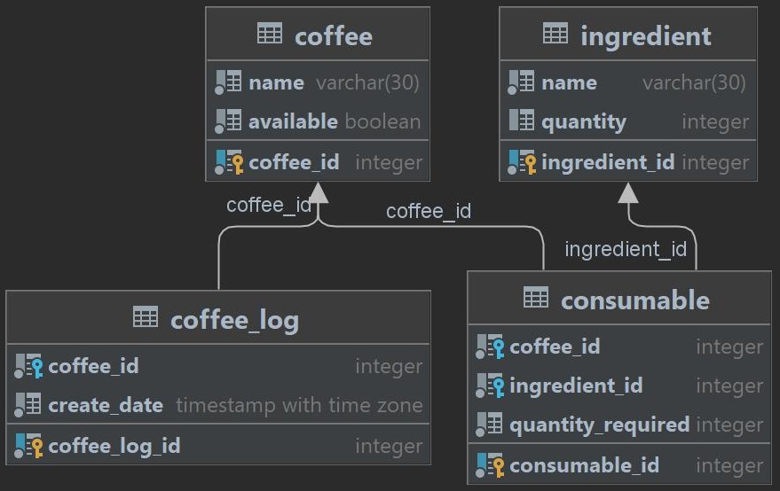

# Кофеварка

    http://localhost:8080/swagger-ui/index.html#
---

## Используемые технологии

---
* Java (Spring Boot Framework)
* PostgreSQL
* Postman
* IntelliJ IDEA
* Flyway
* Docker
* Swagger
* JUnit

## База данных

---
* Развернута в Docker (см. `docker-compose.yml`)
* Схема:
  

## REST API  

---
### 1 Coffee
#### 1.1 Получить список кофе
* URL - `http://localhost:8080/coffee`

* Метод - GET

#### 1.2 Обновить доступность кофе
* URL - `http://localhost:8080/coffee`

* Метод - PATCH

#### 1.3 Получить статус кофе
* URL - `http://localhost:8080/coffee/{id}`

* Метод - GET

#### 1.4 Заказать кофе
* URL - `http://localhost:8080/coffee/order/{id}`

* Метод - GET

### 2 Ingredient
#### 2.1 Получить запасы ингредиентов
* URL - `http://localhost:8080/ingredient`

* Метод - GET

#### 2.2 Пополнить запасы ингредиента
* URL - `http://localhost:8080/ingredient`

* Метод - PATCH

### 3 Coffee Log
#### 3.1 Получить историю заказов
* URL - `http://localhost:8080/coffee/log`

* Метод - GET

